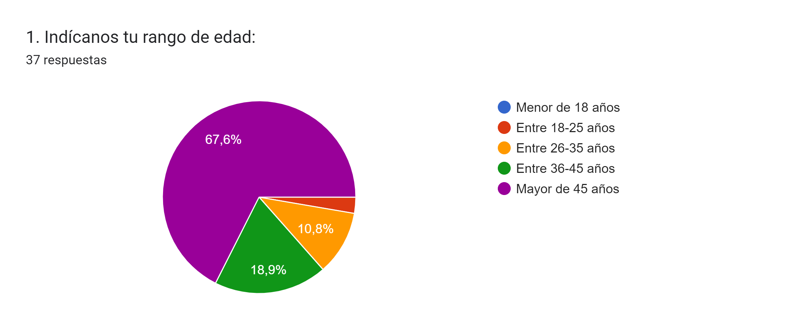
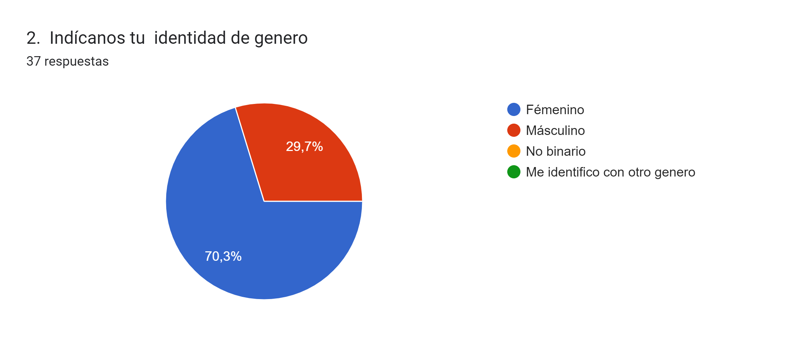
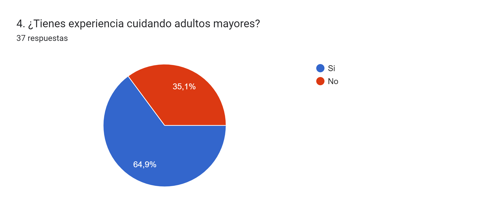
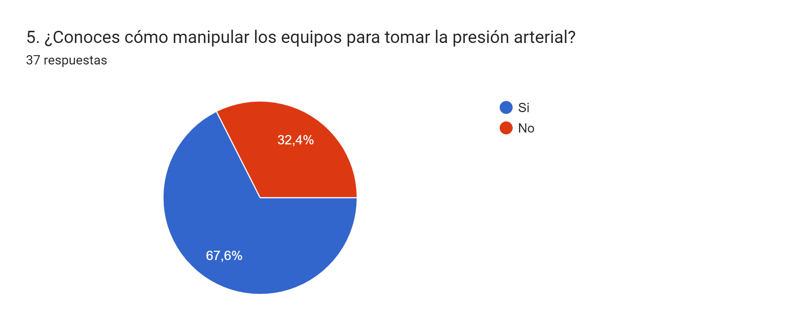
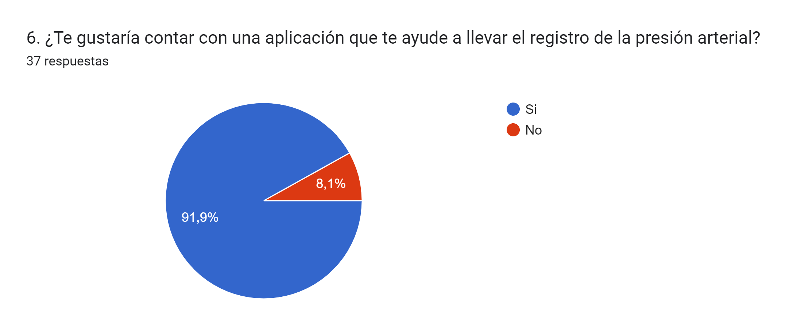
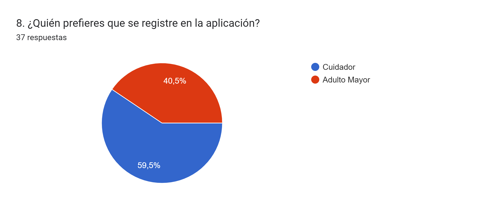

# Mi CUIDADO DIARIO

## Índice

- [1. Mi Cuidado Diario](#1-mi-cuidado-diario)
- [2. Historias de Usuarios](#2-historias-de-usuarios)
- [3. Tecnologías utilizadas](#3-tecnologías-utilizadas)
- [4. Consideraciones generales](#4-consideraciones-generales)

## 1. Mi Cuidado Diario

Mi cuidado diario es una herramienta que te permitirá como cuidador, seguir y controlar la presión arterial, brindar apoyo recordando las actividades que a diario se deben realizar para garantizar la supervivencia física y emocional del adulto mayor.

## 2. Historias de Usuarios

Las historias de usuario se originan a partir de posibles usuarios. Por esta razón, hemos creado una encuesta en Google Forms, enfocándonos en resaltar los siguientes aspectos clave para nuestros usuarios objetivo, obteniendo la siguiente información:

1. Consulta nro. 1

2.  Consulta nro.2

3. Consulta nro.3

4. Consulta nro.4  

5. Consulta nro.5

6. Consulta nro. 6

7. Consulta nro.7

8. Consulta nro. 8

9.  Consulta nro.9

De la información obtenida podemos validar la factibilidad de nuestro proyecto de desarrollo Web "Mi Cuidado Diario".

## 3. Tecnologías utilizadas

### HTML

HTML, siglas en inglés de HyperText Markup Language (‘lenguaje de marcado de hipertexto’), hace referencia al lenguaje de marcado para la elaboración de páginas web.

### CSS

CSS (Cascading Style Sheets), es un lenguaje de diseño gráfico para definir y crear la presentación de un documento estructurado escrito en un lenguaje de marcado.​ Es muy usado para establecer el diseño visual de los documentos web, e interfaces de usuario escritas en HTML

### JavaScript

JavaScript (abreviado comúnmente JS) es un lenguaje de programación interpretado, dialecto del estándar ECMAScript. Se define como orientado a objetos, basado en prototipos, imperativo, débilmente tipado y dinámico. Se utiliza principalmente del lado del cliente, implementado como parte de un navegador web permitiendo mejoras en la interfaz de usuario y páginas web dinámicas​ y JavaScript del lado del servidor (Server-side JavaScript o SSJS). Su uso en aplicaciones externas a la web, por ejemplo en documentos PDF, aplicaciones de escritorio (mayoritariamente widgets) es también significativo.

### NODE

Es un entorno en tiempo de ejecución multiplataforma, de código abierto, para la capa del servidor (pero no limitándose a ello) basado en el lenguaje de programación JavaScript, asíncrono, con E/S de datos en una arquitectura orientada a eventos y basado en el motor V8 de Google.

### BASE DE DATOS (MongoDB)

Es un sistema de base de datos NoSQL, orientado a documentos y de código abierto. En lugar de guardar los datos en tablas, tal y como se hace en las bases de datos relacionales, MongoDB guarda estructuras de datos BSON (una especificación similar a JSON) con un esquema dinámico, haciendo que la integración de los datos en ciertas aplicaciones sea más fácil y rápida.

## 4. Consideraciones generales

¡Lorem ipsum dolor sit amet consectetur adipiscing elit imperdiet libero dictumst, rhoncus pharetra donec orci bibendum praesent cum hendrerit congue velit, posuere dictum nostra fringilla nulla dui maecenas tincidunt molestie.

# MiCuidadoDiario
# Karelis Montenegro - FrontEnd
# Beatriz Maldonado - FrontEnd
# Carla Sarabia - BackEnd
# Eliécer Ache - BackEnd
# Asiul Rosillo - BackEnd
# Germán Oquendo - Tester

